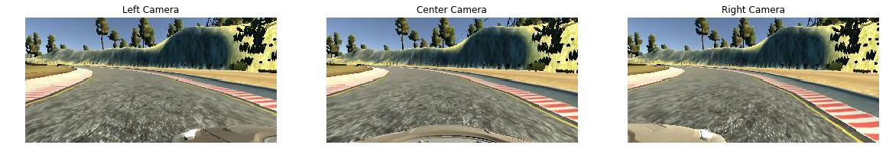

# Self Driving: Behavioral Cloning

Overview
---

1. [model.py](https://github.com/iammsg/Project4/blob/master/model.py) - The script used to create and train the model.
2. [drive.py](https://github.com/iammsg/Project4/blob/master/drive.py) - The script to drive the car.
3. [model.h5](https://github.com/iammsg/Project4/blob/master/model.h5) - The saved model.
4. [Writeup.md](https://github.com/iammsg/Project4/blob/master/writeup.md) - This markdown files explain the structure of your network and training approach. The writeup also includes examples of images from the dataset in the discussion of the characteristics of the dataset. 
5. [video.mp4](https://github.com/iammsg/Project4/blob/master/video.mp4) - A video recording of the vehicle driving autonomously one lap around the track.

These were created in accordance to the [project rubric](https://review.udacity.com/#!/rubrics/1968/view)
